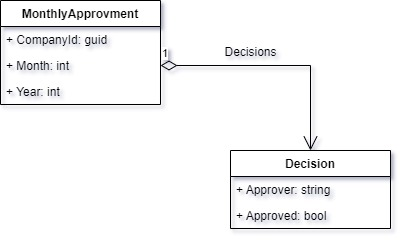

# CleanCodeTraining

## Salaries Payment System

SPS (Salaries Payment System) is a SaaS system that companies use to manage and pay their employees' salaries.  
Each company has 1 or more approvers that need to approve the monthly payment of employees' salaries.
For that, each company has a `MonthlyApproval` object in the db (nevermind which kind of DB - we mock it anyway) that has a list of `Decision` objects.

  

Note: `MonthlyApproval.Approved = false` means a rejection.

Your job is to implement the following logic inside the `ApprovalService.ProcessApproverDecision` method, in a TDD style:  

Everytime an approver approves or rejects:  
1 - A `Decision` object should be added to the relevant `MonthlyApproval` in the DB, and it's done by calling: `IMonthlyApprovalRepository.Update(companyId, month, year, approved, approver)`

2 - Inspect the `MonthlyApproval` object that comes back from  `IMonthlyApprovalRepository.Update`:
- if all approvers approved - pay the salaries by calling `ISalaryPayer.PayAll()`
- if at least one approver rejected - update the bookkeeper by calling IBookkeeperUpdater.Update()`
- If not all company's approvers have sent their approvals/rejections - DO NOTHING! (you can assume it's a paramter of `ApprovalService.ProcessApproverDecision`)

### Advanced:  

`IMonthlyApprovalRepository.Update` works only if the relevant `MonthlyApproval` already exists in the DB, therefore, you first need to understand if it exists and if not - create it, as follows:

3 - Try to fetch the relevant `MonthlyApproval` from the DB by calling `IMonthlyApprovalRepository.Get(companyId, month)`

4 - If not found - insert it with the approver decision by calling  `IMonthlyApprovalRepository.Insert(companyId, month, year, approval, approver)`

5 - If you failed to insert it (method return false) because it already exists (someone else try to inserted it concurrently) - you can perform section 1 above

6 - if the company has only one approver you can call `IMonthlyApprovalRepository.Insert( companyId, month, approval, approver)` and then:
- if the only approver approved - pay the salaries by calling `ISalaryPayer.PayAll()`
- if not all approved - update the bookkeeper by calling `IBookkeeperUpdater.Update()`
